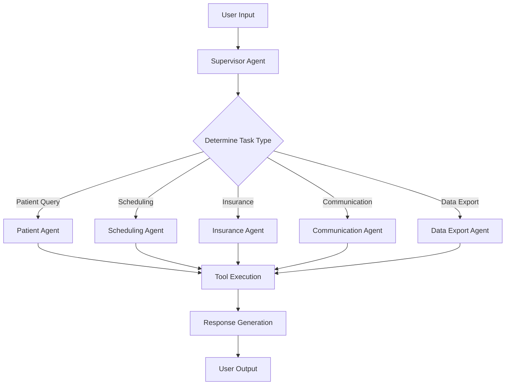

# 🏥 AI Healthcare Scheduling System

A comprehensive, intelligent healthcare scheduling system powered by AI agents, featuring a modern web interface and REST API. This system automates appointment scheduling, patient management, insurance verification, and communication workflows for healthcare facilities.

## ✨ Features

### 🤖 Multi-Agent Architecture
- **Supervisor Agent**: Orchestrates all specialized agents and manages conversation flow
- **Patient Agent**: Handles patient information management and queries
- **Scheduling Agent**: Manages appointments, doctor availability, and calendar operations
- **Insurance Agent**: Verifies insurance coverage and handles billing queries
- **Communication Agent**: Manages email notifications and patient communications
- **Data Export Agent**: Handles reporting and data export functionality

### 💬 Modern Web Interface
- **Streamlit-based UI**: Clean, responsive web interface with modern design
- **Real-time Chat**: Interactive conversation with AI agents
- **Dark Theme Sidebar**: Professional sidebar with white text for optimal visibility
- **Live Logging**: Real-time log viewer for debugging and monitoring
- **Quick Actions**: One-click access to common tasks
- **System Statistics**: Real-time metrics and analytics dashboard

### 🔌 REST API
- **FastAPI-powered**: High-performance REST API with automatic documentation
- **Thread Management**: Persistent conversation threads
- **Health Monitoring**: System status and health check endpoints
- **Async Support**: Non-blocking request handling

### 📊 Data Management
- **Multi-format Support**: CSV, XLSX file handling
- **Patient Records**: Comprehensive patient information management
- **Appointment Scheduling**: Advanced scheduling with conflict detection
- **Insurance Verification**: Automated insurance plan validation
- **Email Integration**: Automated patient notifications

### 🔍 Advanced Logging
- **Multi-level Logging**: DEBUG, INFO, WARNING, ERROR, CRITICAL levels
- **Structured Logging**: JSON-formatted logs for easy parsing
- **Log Rotation**: Automatic log file rotation and management
- **Error Tracking**: Detailed error context and stack traces
- **Performance Monitoring**: Agent operation timing and metrics

## 🚀 Quick Start

### Prerequisites
- Python 3.8+
- OpenAI API Key
- Git

### Installation

1. **Clone the repository**
   ```bash
   git clone <repository-url>
   cd ai-scheduling-agent
   ```

2. **Install dependencies**
   ```bash
   pip install -r requirements.txt
   ```

3. **Set up environment variables**
   ```bash
   # Create .env file
   echo "OPENAI_API_KEY=your_openai_api_key_here" > .env
   ```

4. **Run the application**
   ```bash
   # Start the Streamlit web interface
   streamlit run app.py
   
   # Or start the REST API
   python api/run_api.py
   ```

## 📖 Usage

### Web Interface

1. **Access the application** at `http://localhost:8501`
2. **Configure your OpenAI API key** in the sidebar
3. **Start chatting** with the AI assistant
4. **Use quick actions** for common tasks
5. **Monitor logs** in the Logs tab

### REST API

1. **Start the API server**
   ```bash
   python api/run_api.py
   ```

2. **Access API documentation** at `http://localhost:8000/docs`

3. **Example API usage**
   ```python
   import requests
   
   # Send a message
   response = requests.post('http://localhost:8000/chat', json={
       "message": "Show me today's appointments",
       "thread_id": "user123"
   })
   
   print(response.json())
   ```

## 🏗️ Architecture

### Project Structure
```
ai-scheduling-agent/
├── agents/                 # AI agent implementations
│   ├── supervisor.py      # Main orchestrator agent
│   ├── patient_agent.py   # Patient management agent
│   ├── scheduling_agent.py # Appointment scheduling agent
│   ├── insurance_agent.py # Insurance verification agent
│   ├── communication_agent.py # Email/communication agent
│   └── data_export_agent.py # Data export agent
├── api/                   # REST API implementation
│   ├── main.py           # FastAPI application
│   ├── models.py         # Pydantic models
│   └── run_api.py        # API server runner
├── tools/                 # Agent tool functions
│   ├── patient_tools.py  # Patient-related tools
│   ├── scheduling_tools.py # Scheduling tools
│   ├── insurance_tools.py # Insurance tools
│   ├── communication_tools.py # Communication tools
│   └── export_tools.py   # Data export tools
├── utils/                 # Utility functions
│   ├── logging_config.py # Logging configuration
│   ├── data_loader.py    # Data loading utilities
│   ├── email_utils.py    # Email utilities
│   └── validators.py     # Data validation
├── data/                  # Data files
│   ├── patients.csv      # Patient records
│   ├── appointments.xlsx # Appointment data
│   ├── doctor_schedules.xlsx # Doctor schedules
│   └── insurance_plans.xlsx # Insurance plans
├── logs/                  # Log files
├── app.py                # Streamlit web interface
├── main.py               # Direct agent execution
├── config.py             # Configuration settings
└── requirements.txt      # Python dependencies
```

### Agent Communication Flow


## 🔧 Configuration

### Environment Variables
```bash
# Required
OPENAI_API_KEY=your_openai_api_key_here

# Optional
LOG_LEVEL=INFO
LOG_FILE_PATH=logs/healthcare_scheduler.log
DATA_DIR=data/
EMAIL_HOST=smtp.gmail.com
EMAIL_PORT=587
```

### Configuration File (`config.py`)
The system uses a centralized configuration file with the following sections:
- **Logging Configuration**: Log levels, file paths, rotation settings
- **Data Configuration**: File paths and data sources
- **Email Configuration**: SMTP settings for notifications
- **Agent Configuration**: Agent-specific settings

## 📊 Data Management

### Supported Data Formats
- **CSV**: Patient records, basic data
- **XLSX**: Complex data with multiple sheets (appointments, schedules, insurance)

### Data Files
- `patients.csv`: Patient demographic and contact information
- `appointments.xlsx`: Appointment details and status
- `doctor_schedules.xlsx`: Doctor availability and schedules
- `insurance_plans.xlsx`: Insurance plan details and coverage

### Data Operations
- **Read Operations**: Load data from various sources
- **Write Operations**: Save updated data back to files
- **Validation**: Ensure data integrity and format compliance
- **Backup**: Automatic backup before major operations

## 🔍 Logging and Monitoring

### Log Levels
- **DEBUG**: Detailed diagnostic information
- **INFO**: General information about system operation
- **WARNING**: Warning messages for potential issues
- **ERROR**: Error messages for failed operations
- **CRITICAL**: Critical errors that may cause system failure

### Log Files
- `healthcare_scheduler.log`: Main application log
- `errors.log`: Error-specific log file
- `scheduling_system_structured.json`: Structured JSON logs

### Monitoring Features
- **Real-time Log Viewer**: Built-in log viewer in the web interface
- **Performance Metrics**: Agent execution times and success rates
- **Error Tracking**: Detailed error context and stack traces
- **System Status**: Live system health monitoring

## 🛠️ Development

### Adding New Agents
1. Create agent file in `agents/` directory
2. Implement required methods and tools
3. Register agent in supervisor configuration
4. Add logging and error handling

### Adding New Tools
1. Create tool function in appropriate `tools/` file
2. Add logging and validation
3. Register tool with relevant agent
4. Update documentation

### Testing
```bash
# Run syntax check
python -m py_compile app.py

# Test API components
python -c "from api.main import app; print('API OK')"

# Test agent system
python main.py "test query"
```

## 📚 API Documentation

### Endpoints

#### `GET /`
- **Description**: API information and status
- **Response**: Basic API information

#### `GET /health`
- **Description**: Health check endpoint
- **Response**: System health status

#### `POST /chat`
- **Description**: Send message to AI agents
- **Request Body**:
  ```json
  {
    "message": "string",
    "thread_id": "string"
  }
  ```
- **Response**:
  ```json
  {
    "response": "string",
    "thread_id": "string",
    "timestamp": "string"
  }
  ```

#### `GET /threads`
- **Description**: List all conversation threads
- **Response**: Array of thread information

#### `GET /threads/{thread_id}`
- **Description**: Get specific thread details
- **Response**: Thread information and messages

#### `DELETE /threads/{thread_id}`
- **Description**: Delete a conversation thread
- **Response**: Success confirmation

## 🤝 Contributing

1. Fork the repository
2. Create a feature branch (`git checkout -b feature/amazing-feature`)
3. Commit your changes (`git commit -m 'Add amazing feature'`)
4. Push to the branch (`git push origin feature/amazing-feature`)
5. Open a Pull Request

## 📄 License

This project is licensed under the MIT License - see the [LICENSE](LICENSE) file for details.

## 🆘 Support

### Common Issues

**Q: API key not working**
A: Ensure your OpenAI API key is valid and has sufficient credits. Check the key in the sidebar configuration.

**Q: Import errors**
A: Make sure all dependencies are installed: `pip install -r requirements.txt`

**Q: Data not loading**
A: Check that data files exist in the `data/` directory and have the correct format.

**Q: Logs not appearing**
A: Verify log directory permissions and check the log level configuration.

### Getting Help
- Check the logs in the `logs/` directory
- Use the built-in log viewer in the web interface
- Review the API documentation at `/docs` endpoint
- Check system status in the sidebar

## 🔮 Roadmap

### Planned Features
- [ ] Database integration (PostgreSQL/MySQL)
- [ ] Advanced analytics dashboard
- [ ] Mobile app support
- [ ] Multi-language support
- [ ] Advanced scheduling algorithms
- [ ] Integration with popular EHR systems
- [ ] Voice interface support
- [ ] Advanced reporting and insights

### Version History
- **v1.0.0**: Initial release with basic functionality
- **v1.1.0**: Added REST API and enhanced logging
- **v1.2.0**: Modern UI redesign and improved UX
- **v1.3.0**: Enhanced error handling and monitoring

---

**Built with ❤️ for healthcare professionals**

*This system is designed to streamline healthcare scheduling operations and improve patient care through intelligent automation.*
